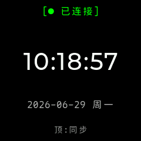
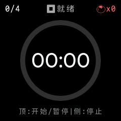
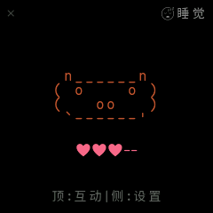
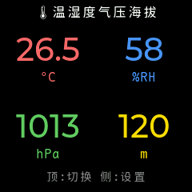
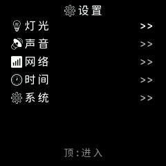
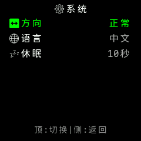
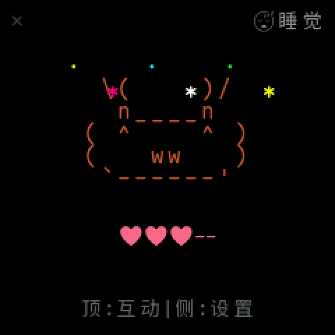

# Pomodoro Buddy

基于 ESP32-C3 的番茄钟与 AI Buddy 伴侣设备，通过 TCP 连接 [Claude Code Buddy Bridge](https://github.com/oh-myfun/ccbb) 实时审批 Claude 工具调用权限，配 ASCII 像素宠物陪伴你专注。

240×240 ST7789 LCD 显示，EC11 编码器 + 顶键输入，WS2812 RGB LED 指示，PWM 蜂鸣器反馈。

## 界面预览

<table>
  <tr>
    <td width="33%" align="center"><b>主界面</b><br/>大字号时钟 + 日期 + WiFi 状态</td>
    <td width="33%" align="center"><b>番茄钟</b><br/>圆弧进度环 + 剩余时间</td>
    <td width="33%" align="center"><b>Buddy 伴侣</b><br/>ASCII 像素宠物 + 心心</td>
  </tr>
  <tr>
    <td></td>
    <td></td>
    <td></td>
  </tr>
  <tr>
    <td align="center"><b>传感器</b><br/>温度/湿度/气压/海拔 4 象限</td>
    <td align="center"><b>设置</b><br/>亮度/声音/WiFi/时间/系统</td>
    <td align="center"><b>系统设置</b><br/>编码器方向/语言/休眠超时</td>
  </tr>
  <tr>
    <td></td>
    <td></td>
    <td></td>
  </tr>
</table>

> 截图由 `tools/simulator/` 的 PC LVGL 模拟器（MinGW GCC + LVGL v9.5 离屏渲染）生成，与设备显示一致。生成方法见 [PC 模拟器](#pc-模拟器)。

### Buddy 庆祝动画

任务批准后 Buddy 会切换到 CELEBRATE 状态做庆祝动作（不同物种有不同动画）：

<p align="center">
  
</p>

## 功能特性

### 番茄钟

- 可配置工作（1-120 分钟）/休息（1-60 分钟）/长休息（1-60 分钟）/周期数（1-10）
- 自动 / 手动两种模式：自动模式连续推进，手动模式每阶段结束等待用户确认
- 圆弧进度环可视化剩余时间
- 完成 N 个周期自动进入长休息
- NVS 持久化完成数

### 倒计时时钟

- 独立于番茄钟的简单倒计时（1-360 分钟）
- 到点蜂鸣 + 红色 LED 闪烁
- 适合做"15 分钟后提醒"等单次定时

### AI Buddy 伴侣

- 18 种 ASCII 像素宠物：水豚、鸭子、猫、龙、企鹅、章鱼、幽灵、机器人、蘑菇等
- 状态机：SLEEP / IDLE / BUSY / ATTENTION / CELEBRATE / DIZZY / HEART
- 通过 TCP 接收 Claude Code 的权限请求，**设备上一键批准/拒绝**
- 整点报时（可选静默时段）
- 心心等级反映近期审批通过率
- 长按顶键切换物种

### 传感器（AHT20 + BMP280）

- 温度（°C）、湿度（%RH）、气压（hPa）、海拔（m）
- 4 象限实时显示
- 折线图模式：秒/分/时/日 4 个时间维度切换
- 30 天历史数据持久化（天级）

### WiFi 与 NTP

- 多 profile 保存（最多 10 个）
- **自动连接策略**：
  - 启动时扫描 + 按 RSSI 强弱依次尝试保存的网络
  - 顶键手动触发扫描 + 连接（未连接时）
  - 顶键手动触发 NTP 同步（已连接时）
  - 意外断开后指数退避重连同一 SSID（2s→60s，最多 10 次）
  - 未保存网络时不触发任何自动逻辑
- NTP 自动同步严格按设定间隔的整数倍触发（5/10/30/60/120/240/480/1440 分钟）
- NVS 持久化最近时间，重启后无需等 NTP

### LED 指示（WS2812）

- 中心 LED 持续指示状态（工作红、休息绿、长休蓝、暂停黄、注意红闪）
- 外环 LED 触发动画（2 轮闪烁）
- 可调亮度 / 速度 / 样式（纯色 / 多彩）/ 动画（呼吸 / 扫描 / 渐变）
- 关闭后完全熄灭

### 声音反馈（PWM 蜂鸣器）

- 按键 / 确认 / 取消 / 成功 / 失败 等场景化提示音
- WiFi 连接 / NTP 同步 / 番茄钟阶段切换音效
- 整点（敲钟次数 = 当前小时 12 制）/ 半点（双音）报时
- 7 类独立开关 + 总开关
- 静默时段（按小时区间，如 23:00-07:00）

### 普通休眠

- 用户无操作达到超时阈值后进入低功耗：
  - 背光降到最低档（1%）
  - PM lock 释放，DFS 自动降到 40MHz
  - LVGL tick 从 1ms 改为 100ms（减少 esp_timer 中断）
  - 传感器采集间隔从用户设置（默认 10s）切到 60s
- 任意输入事件（编码器旋转/按键/顶键）唤醒并恢复全部参数
- 7 档超时：OFF / 10s / 30s / 1m / 2m / 5m / 10m
- 可选"buddy 工作时不休眠"开关（伙伴设置子屏）

## 硬件

| GPIO | 功能 |
|------|------|
| GPIO0 | I²C SCL（AHT20 + BMP280）|
| GPIO1 | I²C SDA |
| GPIO2 | 蜂鸣器 PWM（LEDC）|
| GPIO3 | LCD 复位（RST）|
| GPIO4 | EC11 编码器 A 相 |
| GPIO5 | EC11 编码器 B 相 |
| GPIO6 | LCD SPI 时钟（SCK）|
| GPIO7 | LCD SPI 数据（MOSI）|
| GPIO8 | WS2812 RGB LED |
| GPIO9 | 顶键（低电平有效）|
| GPIO10 | LCD 数据/命令（DC）|
| GPIO20 | 背光 PWM |
| GPIO21 | 编码器按键（低电平有效）|

**主控：** ESP32-C3，4MB Flash，~400KB RAM
**屏幕：** ST7789 240×240 RGB565，SPI + DMA @ 60MHz
**技术栈：** ESP-IDF v5.5.4 + LVGL v9.5 + FreeRTOS

## 构建

ESP-IDF v5.5.4 不再支持 MSys 环境，项目封装了 `build.sh`：

```bash
./build.sh                       # 构建
./build.sh flash                 # 烧录
./build.sh -p COM7 flash monitor # 烧录并监视
./build.sh clean                 # 清理
./build.sh erase-flash           # 擦除（NVS 损坏时）
```

PowerShell 直接构建：

```powershell
$env:IDF_PATH="D:\Espressif\frameworks\esp-idf-v5.5.4"
& "$env:IDF_PATH\export.ps1"
idf.py build
```

## 软件架构

### 任务模型

| 任务 | 优先级 | 栈 | 循环 | 职责 |
|------|-------|-----|------|------|
| LVGL | 5 | 8KB | 1-100ms | `lv_timer_handler()` 渲染循环 |
| Input | 3 | 8KB | 阻塞队列 | 编码器/按键 → UI 回调 |
| Service | 2 | 4KB | 200ms | NTP tick + buddy 动画 |
| UIUpdate | 1 | 4.5KB | 500ms | 番茄钟/报时/WiFi 状态/各屏刷新 |

### 模块分层

```
┌──────────────────────────────────────────────────────────┐
│                  ui/（LVGL 界面层）                       │
│  ui_manager + 20+ ui_screen_* + ui_list + ui_text_input  │
├──────────────────────────────────────────────────────────┤
│       buddy/        pomodoro/        input/               │
│  buddy 状态机     pomodoro_engine   input_handler         │
│  buddy_render     (番茄钟)          (编码器/按键)         │
│  buddies/* (18 物种像素画)                                │
├──────────────────────────────────────────────────────────┤
│                  service/（系统服务层）                    │
│  wifi  time  storage  tcp  sound  led  chime  sensor     │
├──────────────────────────────────────────────────────────┤
│                  driver/（硬件驱动层）                     │
│  st7789_lcd(SPI+DMA)  buzzer(LEDC)  ws2812(RMT)          │
│  backlight(PWM)  aht20(I²C)  bmp280(I²C)                 │
├──────────────────────────────────────────────────────────┤
│   ESP-IDF v5.5.4  │  LVGL v9.5  │  FreeRTOS  │  NVS     │
└──────────────────────────────────────────────────────────┘
```

### 输入分发

每个屏幕创建时注册 5 个回调（cw/ccw/press/long_press/settings_press），`ui_manager` 查找当前屏的回调表分发。导航栈支持 push/pop（设置子页→返回）。

### 持久化

NVS 4 个命名空间：`wifi` / `pomodoro` / `settings` / `buddy`，所有可配置项均持久化，断电后恢复。

## PC 模拟器

模拟器在 PC 上跑 LVGL 离屏渲染，**复用项目实际 UI 代码**（ui_screen_*.c、字体、像素画），mock ESP-IDF / FreeRTOS / service 层，输出与设备一致的 PNG。

### 依赖

- MinGW-w64 GCC（如 [MSYS2](https://www.msys2.org/) 的 `mingw64/bin/gcc.exe`）
- CMake ≥ 3.16

### 生成截图

```bash
cd tools/simulator
cmake -S . -B build -G "MinGW Makefiles" \
  -DCMAKE_C_COMPILER=/c/msys64/mingw64/bin/gcc.exe \
  -DCMAKE_MAKE_PROGRAM=/c/msys64/mingw64/bin/mingw32-make.exe
mingw32-make -C build -j4
./build/sim.exe
# 输出到 tools/simulator/output/*.png
```

### 结构

```
tools/simulator/
├── CMakeLists.txt       # 引用 LVGL 源码 + 项目 main/ui
├── lv_conf.h            # LVGL 配置（启用 montserrat_40 + custom_font）
├── main.c               # 离屏渲染 + PNG 导出
├── stb_image_write.h    # 单头 PNG 编码（无 zlib 压缩）
├── time_compat.h        # Windows localtime_r 兼容
├── mocks/               # ESP-IDF + FreeRTOS + driver 头文件 stub
│   ├── esp_*.h
│   ├── freertos/*.h
│   └── driver/*.h
├── fake/fake_services.c # service / buddy / input 的假实现
└── output/              # 生成的 PNG
```

修改 UI 代码后，重跑 `./build/sim.exe` 即可重新生成全部截图，无需硬件。

## 文档

- [CLAUDE.md](CLAUDE.md) — 项目结构与约定（给 AI 协作者的上下文）
- [docs/architecture.md](docs/architecture.md) — 任务模型 / 模块分层
- [docs/functional_spec.md](docs/functional_spec.md) — 功能规格
- [docs/superpowers/](docs/superpowers/) — 历次重构的计划与设计文档

## License

MIT
